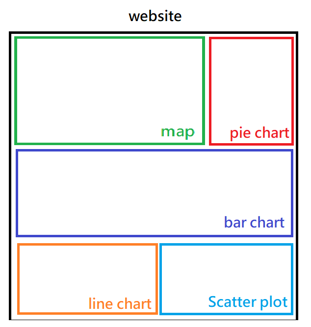

## 113-1 Data Visualization Proposal

## Section I : Basic Info

##### Project Title

UBike Real-Time Data Analysis Website

##### Group Member

盧昱安 41247001s [me@andy-lu.dev](me@andy-lu.dev)  
鄭兆宏 41247008s [41247008s@gapps.ntnu.edu.tw](41247008s@gapps.ntnu.edu.tw)

## Section II : Overview

**YouBike** has been one of the popular mode of transport which is replacing traditional public transportation. A large quantity of **students** and **workers** may select **YouBike** as their main transport method for daily routine. However, it is often for users cannot find any free bikes during the rush hours. Therefore, we managed to write this project to **solve relative issues**.

We'll build a **real-time** map based on **Python Folium** for user to **interact** and **select** the specific area. Then, the website will automatically generate plots and charts by **D3.js**.

On the other hand, we'll add **timeline function** for users to observe or check the status of UBike in various timeline.

## Section III : Data and Data Processing

##### Real-time UBike API :

The API is useful since it normally updates every minute, so our website will be able to offer users real-time data.

https://tcgbusfs.blob.core.windows.net/dotapp/youbike/v2/youbike_immediate.json

##### Charts and Plots made by D3.js:

As mentioned above, charts and plots can be adjusted and showing the information in different timeline.

|Chart/Plot|X axis|Y axis|The Info Giving to user|
|-|-|-|-|
|Bar Chart (No Specific Selection)|District|Availible Bikes|Status of bike amounts in different district|
|Bar Chart (With Selecting Specific Area)|UBike Stations in selected area|Availible Bikes|Status of bike amounts of different station|
|Pie Chart (No Specific Selection)|||Proportion of bike amounts in different district|
|Pie Chart (With Selecting Specific Area)|||Proportion of bike amounts in different station|
|Scatter Plot (No Specific Selection)|Amounts of availible bikes in different district|Amounts of availible parking space in different district|Check X axis if user want to rent bike, Check Y axis if user want to park the bike|
|Scatter Plot (With Selecting Specific Area)|Amounts of availible bikes in different station|Amounts of availible parking space in different station|Check X axis if user want to rent bike, Check Y axis if user want to park the bike|
|Line Chart|Different timeline|Status of availible bike|Showing the status changes of a specific UBike station, tell the user the trend of a specific station|

## Section 4: Usage scenarios & tasks

##### Example I

Bob is a student who rent UBike to get to school everyday and he wants to know the status of different UBike station near his home and school. However, sometimes does the official applications update slowly and not giving user real-time data, which may cause Bob for being late to school. Therefore, Bob starts to use our website to check the status everyday. After using our service, never does he being late to school and he improve his academic performance since he can efficiently done his daily transport routine.

**Core Meaning of Example I :** Helping residents and users to find a bike to rent or a station to park the bike efficiently.

  

##### Example II

Amy is a researcher who observe how does UBike change people's daily routine after UBike release. However, she can't find any data about the condition of different district. She really need the data in order to see which district needs to place and build more stations. Our service will be able to solve her problem effectively.

**Core Meaning of Example II :** Plotting official data for researchers or students which need the distribution of bike data.

##### Example III

Jack is required to write a report for his social studies homework and he manages to get the data showing the percentage of bike amounts in different areas. Although he knows that there are API for developers, but he don't know how to coding and he then realize that there is an online service which may help him.

**Core Meaning of Example III :** Reduce the gap for normal users and developers to obtain the data about the UBike. Constructing the data for non-coding people who may need the informations in the API.

## Section 5: Visualization Design & Sketch

##### Python Folium Map Showcase

As the showcase above, Python Folium map offer functions which can place the marker in the map. We can insert the bike stations according to every stations' lat and longtitude which is provided in API. 

What's more, Folium offers built-in tooltip  and map scaling function, giving the user a good and wonderful user experience.

The example above is we wrote a python script to download OpenStreetMap and insert UBike stations markers in the map.

  

##### Plots and Charts

We'll visualize the data mentioned above with D3.js plots and charts. Every plots' and charts' info are mentioned in section III.

The example above is the charts in homework IV.

    

##### Sketch of the website

    
    
    
    

## Section 6: Work breakdown and schedule

##### ToDo

`Server storage (12/4)`
- [ ] `Basic storage and API ruleset`

`History System (12/7)`
- [ ] `Auto Storing UBike API Data Every mins`

`Python Folium Map (12/7)`
- [ ] `Map Selection Button`
- [ ] `Station Marker Color Difference`

`D3.js (12/13)` 
- [ ] `Bar Chart`
- [ ] `Pie Chart`
- [ ] `Plot`
- [ ] `Line Chart`

`Extra Function + Frontend Design (12/15)`
- [ ] `Search Function`
- [ ] `Change Language`
- [ ] `Light / Dark Theme`
